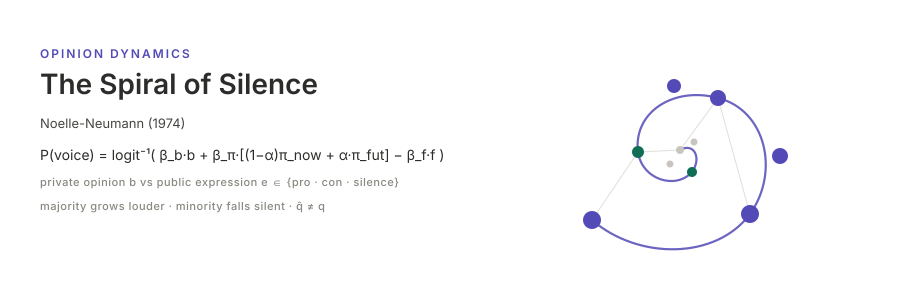

<p align="center"></p>

[English](README.md) | **日本語**

# 沈黙の螺旋 — Noelle-Neumann (1974)

Elisabeth Noelle-Neumann の *The Spiral of Silence: A Theory of Public Opinion* (*Journal of Communication* 24(2), 43–51) をエージェントベースの意見動学モデルとして再現実装したものである．理論の核心は，個人の**私的意見** `b_i ∈ [-1,1]`（外生衝撃なき限り固定）と**公的表出** `e_i ∈ {賛成発言, 反対発言, 沈黙}` の**二層分離**にある．各エージェントは「準統計的器官」として，近傍の**公的表出のみ**（私的意見は観測不可）を観察して現在および未来の意見気候における自分の立ち位置を知覚し，誤りより社会的孤立を恐れるため，自分の側が劣勢と知覚するほど沈黙する．発言／沈黙の非対称が網を通じてフィードバックし，一方の陣営はますます声高に，他方は静かになる — 自己強化的な**沈黙の螺旋**と，**知覚支持率と実支持率の乖離**が生じる．

本実装は外生的な**媒体シグナル**（論文の「マスメディアは世論を創出するものと見なされねばならない」の操作化），**未来評価**機構（発言可否は現在より未来の気候が支配するという H5 仮説），**ハードコア**境界（沈黙を拒む低閾値・高動員度の少数派）を加える．シミュレーション本体は [socsim](https://github.com/akitenkrad/rs-social-simulation-tools) フレームワーク上の Rust，可視化・再現ツールは Python である．

## インストールとクイックスタート

```bash
# Rust シミュレーションのビルド（ルールベース決定モード；LLM 依存なし）
cargo build --release

# 社会主義到来シナリオの baseline（n=1000，真の支持率 q=0.37）
cargo run --release -- run \
    --n 1000 --true-support 0.37 --network-model watts-strogatz \
    --eta-m 0.5 --alpha 0.7 --hardcore-frac 0.05 --t-max 80 --seed 42

# Python 可視化ツールのインストール（workspace ルートで）
uv sync

# 直近の実行結果を可視化（螺旋軌跡 + 陣営別発言意欲）
uv run noelleneumann-tools visualize

# 論文 Table 1--5 アンカーの再現
cargo run --release -- reproduce --seed 42
uv run noelleneumann-tools reproduce
```

任意の LLM 内省 ablation（言語モデルに「孤立の恐怖」を内省させて発言／沈黙を決める）は Cargo feature の背後にあり，**既定では無効**である — 既定ビルドは LLM バックエンドを必要としない:

```bash
OLLAMA_MODEL=llama3.1 cargo run --release --features llm -- run --decision-mode llm \
    --n 200 --t-max 40 --seed 42 --cache-path .llm_cache/spiral.json
```

プロンプト→応答キャッシュは `--cache-path` に永続化されるため，同一引数の温暖な再実行はモデルを再呼び出しせずディスクから再生される (100% cache-hit)．詳細は [CLI](docs/cli.md) を参照．

## ドキュメント

- [ユースケース](docs/usecases.ja.md) — 本プロジェクトでできること，他ドキュメントへの導線．
- [CLI](docs/cli.ja.md) — Rust CLI の `run` / `sweep` / `reproduce` サブコマンドとフラグ．
- [可視化](docs/visualization.ja.md) — Python `noelleneumann-tools` と出力の解釈．
- [再現](docs/reproduction.ja.md) — Table 1--5 アンカーと，調査クロスセクションを ABM 定常状態へ対応づける方法．
- [アーキテクチャ](docs/architecture.ja.md) — リポジトリ構成，socsim フレームワーク，6 フェーズ上の 9 機構，数式，参考文献．

## ライセンス

MIT

---
*This file was generated by Claude Code.*
